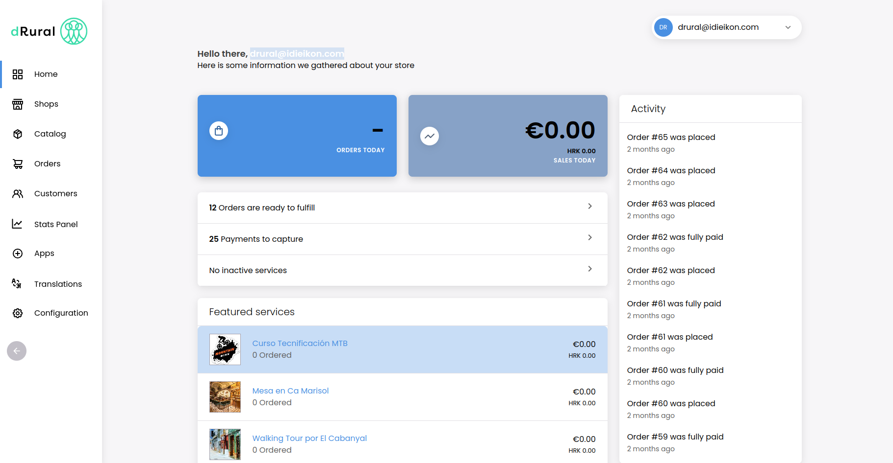

# dRural Dashboard

The Dashboard is a React web application which implements the user interface that sellers and staff members can use to manage and operate inside the marketplace. It uses Apollo Client to connect to the dRural GraphQL API.



## Demo

See the [public demo](https://dashboard.drural-sandbox.eu/) of dRural Dashboard!

## Getting Started

Checkout the [dRural infrastructure folder](../infraestructure/README.md) in the develop branch, these instructions will get you a copy of the project up and running on your local machine for development and testing purposes.

## Understading the project structure

Let's take a look at the more important parts of the project:

- **`assets`** - Contains all the images and other assets used in the app.

- **`locale`** - Contains the translations of the Dashboard.

- **`src`** - Contains the source code of the Dashboard. It is divided in the app sections. Ususally, they follow this structure:

  - **`section`**:

    - `index.tsx` - The entry point of the section that contains the routing and the rendering of the diferent views.

    - `views` - Contains the views of the section.

    - `components` - Contains the components of the section.

    - `queries` - Contains the queries of the section.

    - `mutations` - Contains the mutations of the section.

    - `types` - Contains the graphql autogenerated types of the queries and mutations of the section.

    - `urls` - Contains the paths and urls of the section.

  - **`index.html`** - The html template of the app.

  - **`index.tsx`** - The entry point of the application. Contains most of the providers of the aplication (Apollo Client, Intl, Theme provider...) and renders the app.

  - **`Routes.tsx`** - Contains the routes and the sections of the app. Is is rendered in the `index.tsx` comented above.

  - **`config.ts`** - Contains and parses some important configuration and variables used in the dashboard.

  - **`intl.ts`** - Contains most of the reusable messages of the app.

- **`env.example`** - Contains the example of the environment variables that the app uses.

- **`webpack.config.js`** - Contains the configuration of the webpack bundler. Here you can parse the enviroment variables and modify the configuration of the app.

- **`Dockerfile`** - Contains the Docker configuration to build the app.

- **`Dockerfile.dev`** - Contains the Docker configuration to build the app in development mode.

## How to

### Run the project

Checkout the [dRural infrastructure folder](../infraestructure/README.md).

### Build graphql types

The project uses [graphql-codegen](https://www.apollographql.com/tutorials/lift-off-part1/09-codegen) to generate types from the graphql queries. In order to generate the types you need to have the dRural API running. To generate the types:

1. Download the dRural API schema:

```bash
npm run schema:download
```

2. Generate the types:

```bash
npm run codegen:generate
```

This will generate a `types/` folder a the level of each query and mutation file with the types of them. And also a `src/types/globalTypes.ts` file with the global types of the app.

### Add traslations

Dashboard application supports internationalization via [react-intl](https://formatjs.io/docs/getting-started/installation/). All components use react-intl to translate messages and global configuration is applied via LocaleProvider. To add new translations:

1. Extract the messages:

```bash
npm run extract-messages
```

This will extract the messages from the components and put them in the `locale/defaultMessages.json` file.

2. Add the translations to the diferent languages in the `locale` folder.
