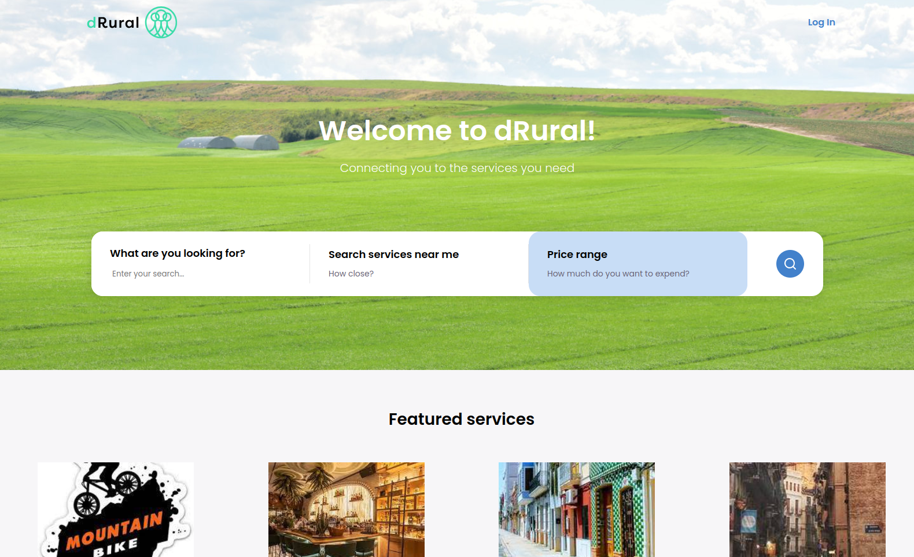

# dRural Storefront

The Storefront is the marketplace storefront user interface that customers and all members can use to buy services and make use of it. It is a React web application based on Next.js. It also uses Apollo Client to connect to the dRural GraphQL API.



## Features

- Headless ecommerce storefront built with [GraphQL](https://graphql.org/), [Apollo Client](https://www.apollographql.com/client), [React](https://reactjs.org/), [Next.js](https://nextjs.org/) and [Typescript](https://www.typescriptlang.org/)
- Offline mode (beta)
- dRural GraphQL API integration
- Single-page application experience
- [Stripe Payment Gateway](https://stripe.com/es/payments) integration

## Demo

See the [public demo](https://drural-sandbox.eu/en/) of dRural Storefront!

## Getting Started

Checkout the [dRural infrastructure repository](https://github.com/Emergya/drural-marketplace-infraestructure/tree/develop) in the develop branch, these instructions will get you a copy of the project up and running on your local machine for development and testing purposes.

## Understading the project structure

Let's take a look at the more important parts of the project:

- **.jest/** - Contains the Jest configuration files.

- **.storybook/** - Contains the Storybook configuration files.

- **content/** - Contains the messages content and it's translations for the storefront application. See more about translations later.

- **config/** - Contains the Next.js configuration files: mainly webpack configuration and workbox (beta - not working) configuration.

- **public/** - Contains the public assets like images, favicons, etc.

- **src/** - Contains the source code of the storefront.

  - **pages/** - Contains the Next.js pages of the storefront. This folder contains the files that are translated to [Next.js routing](https://nextjs.org/docs/basic-features/pages).

    - **app.tsx** - Main entry point file. Render's the App component, apollo-client, and other providers to the root div in index.html file above. Contains also a head section - You can change the title of storefront here.

  - **src/app/App.tsx** - This is main App component that renders the Header, Routes (explained above), Footer and a couple other components.

  - **constants.ts** - Contains and parse some important .env varaibles used in the storefront.

  - **paths** - Contains the paths and routes of the application.

  - **@next/** - Contains the components aligned to the new project. These are the most up to date and are styled with [styled components](https://styled-components.com/). To create new components use these approach instead of the old one. Read more about there structure in the [README](./src/%40next/README.md) of the section.

  - **components/** - Contains the old-legacy components. These are styled in [scss](https://sass-lang.com/). Use them only if needed.

  - **core/** - Contains the core logic of the old storefront app, not much used in the new one (legacy).

  - **globalStyles/** - Contains the sccss global styles and theme applied to the old components (legacy).

  - **images/** - Contains all the images used in the storefront.

  - **views/** - Contains the some of the views of the storefront. This file is similar to the [@next/pages](./src/%40next/pages) folder, but with the old structure (legacy). Usually, the views have a file named "Page.tsx" that controls the layout of the page and a file named "View.tsx" that calls the query and renders the Page component with the data.

- **.env.example** - Contains the environment variables. See the infrastructure repository to know how to set them up.

- **Dokerfile** - Contains the Docker configuration to build the storefront.

- **Dokerfile.dev** - Contains the Docker configuration to build the storefront in development mode.

- **next.config.js** - Contains the Next.js configuration file. Here you can new languages to the storefront.

How to:

## How to

### Run the project

Checkout the dRural infrastructure repository in the develop branch. The recomended way is to use the docker-compose file to run the project.

### Build graphql types

The project uses [graphql-codegen](https://www.apollographql.com/tutorials/lift-off-part1/09-codegen) to generate types from the graphql queries. In order to generate the types you need to have the dRural API running. To generate the types run the following command:

```bash
npm run codegen
```

This will generate a `graphql/` folder a the level of each query and mutation file with the types of them.

### Add translations

The application supports internationalization via [react-intl](https://formatjs.io/docs/getting-started/installation/). All components use react-intl to translate their strings and messages and global configuration is applied via LocaleProvider.. To add new translations:

1. Run the comand to extract the messages:

```bash
npm run extract:i18n
```

- This will output the new messages in the `content/locales` folder.

2. Translate the messages in the `content/locales` folder for each language.

3. Run the command to compile the messages:

```bash
npm run compile:i18n
```

- This will compile the messages to the `content/compiled-locales` folder. The messages are now ready to be used in the application.
